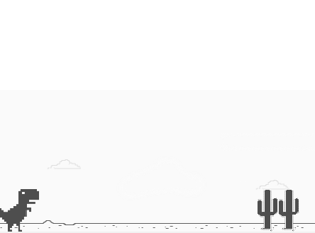

# dio-dino-game
Pequena modificação do Lab "Recriando o famoso jogo do dinossauro sem Internet" da [Digital Innovation One] (https://digitalinnovation.one).

O número de saltos consecutivos agora é mostrado ao fim do jogo.

## Tecnologias utilizadas
- HTML
- CSS
- JavaScript

## Instruções
Para jogar, abra o `index.html` no seu navegador da Web.

Pressione a barra de espaços para pular sobre os cactos.

## Screenshots

